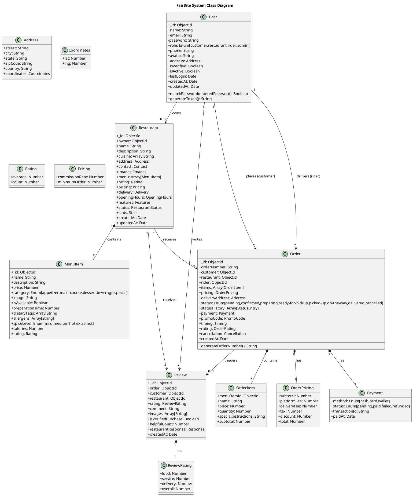

# Class Diagram (PlantUML Format)

```plantuml
@startuml FairBite-ClassDiagram
title FairBite System Class Diagram

skinparam classAttributeIconSize 0

class User {
  +_id: ObjectId
  +name: String
  +email: String
  -password: String
  +role: Enum[customer,restaurant,rider,admin]
  +phone: String
  +avatar: String
  +address: Address
  +isVerified: Boolean
  +isActive: Boolean
  +lastLogin: Date
  +createdAt: Date
  +updatedAt: Date
  --
  +matchPassword(enteredPassword): Boolean
  +generateToken(): String
}

class Address {
  +street: String
  +city: String
  +state: String
  +zipCode: String
  +country: String
  +coordinates: Coordinates
}

class Coordinates {
  +lat: Number
  +lng: Number
}

class Restaurant {
  +_id: ObjectId
  +owner: ObjectId
  +name: String
  +description: String
  +cuisine: Array[String]
  +address: Address
  +contact: Contact
  +images: Images
  +menu: Array[MenuItem]
  +rating: Rating
  +pricing: Pricing
  +delivery: Delivery
  +openingHours: OpeningHours
  +features: Features
  +status: RestaurantStatus
  +stats: Stats
  +createdAt: Date
  +updatedAt: Date
}

class MenuItem {
  +_id: ObjectId
  +name: String
  +description: String
  +price: Number
  +category: Enum[appetizer,main-course,dessert,beverage,special]
  +image: String
  +isAvailable: Boolean
  +preparationTime: Number
  +dietaryTags: Array[String]
  +allergens: Array[String]
  +spiceLevel: Enum[mild,medium,hot,extra-hot]
  +calories: Number
  +rating: Rating
}

class Order {
  +_id: ObjectId
  +orderNumber: String
  +customer: ObjectId
  +restaurant: ObjectId
  +rider: ObjectId
  +items: Array[OrderItem]
  +pricing: OrderPricing
  +deliveryAddress: Address
  +status: Enum[pending,confirmed,preparing,ready-for-pickup,picked-up,on-the-way,delivered,cancelled]
  +statusHistory: Array[StatusEntry]
  +payment: Payment
  +promoCode: PromoCode
  +timing: Timing
  +rating: OrderRating
  +cancellation: Cancellation
  +createdAt: Date
  --
  +generateOrderNumber(): String
}

class Review {
  +_id: ObjectId
  +order: ObjectId
  +customer: ObjectId
  +restaurant: ObjectId
  +rating: ReviewRating
  +comment: String
  +images: Array[String]
  +isVerifiedPurchase: Boolean
  +helpfulCount: Number
  +restaurantResponse: Response
  +createdAt: Date
}

class OrderItem {
  +menuItemId: ObjectId
  +name: String
  +price: Number
  +quantity: Number
  +specialInstructions: String
  +subtotal: Number
}

class OrderPricing {
  +subtotal: Number
  +platformFee: Number
  +deliveryFee: Number
  +tax: Number
  +discount: Number
  +total: Number
}

class Payment {
  +method: Enum[cash,card,wallet]
  +status: Enum[pending,paid,failed,refunded]
  +transactionId: String
  +paidAt: Date
}

class ReviewRating {
  +food: Number
  +service: Number
  +delivery: Number
  +overall: Number
}

class Rating {
  +average: Number
  +count: Number
}

class Pricing {
  +commissionRate: Number
  +minimumOrder: Number
}

' Relationships
User "1" --> "0..1" Restaurant : owns
User "1" --> "*" Order : places (customer)
User "1" --> "*" Order : delivers (rider)
User "1" --> "*" Review : writes

Restaurant "1" *-- "*" MenuItem : contains
Restaurant "1" --> "*" Order : receives
Restaurant "1" --> "*" Review : receives

Order "1" *-- "*" OrderItem : contains
Order "1" *-- "1" OrderPricing : has
Order "1" *-- "1" Payment : has
Order "1" --> "0..1" Review : triggers

Review "1" *-- "1" ReviewRating : has

@enduml
```

---
*Render at: https://www.plantuml.com/plantuml/uml/*
