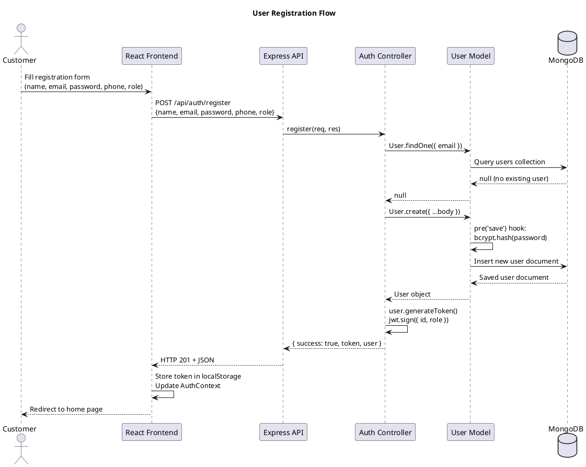
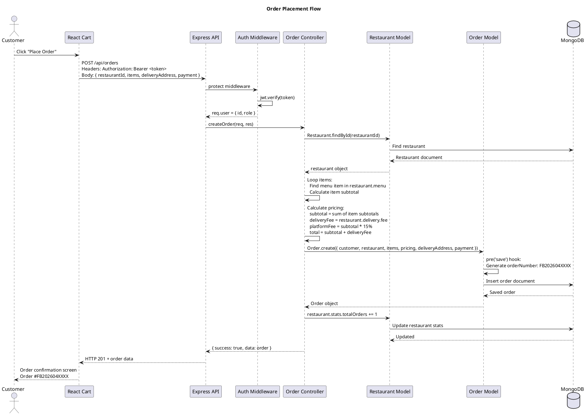
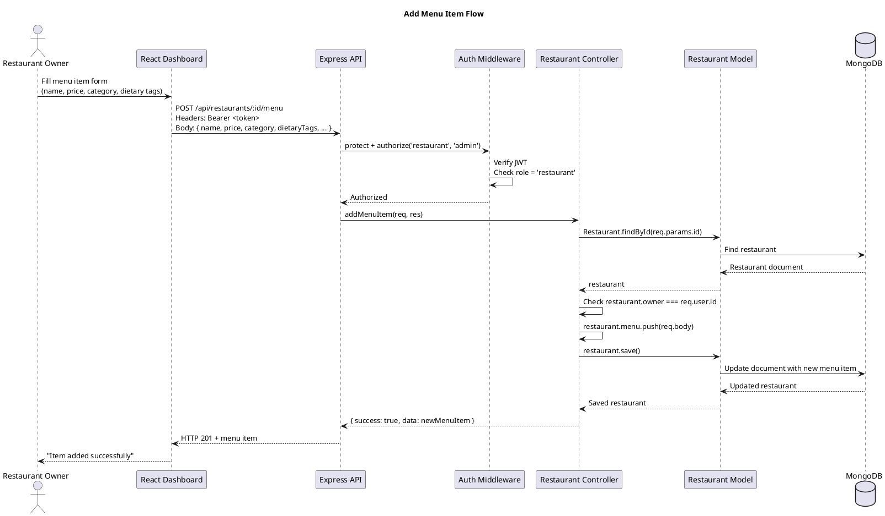
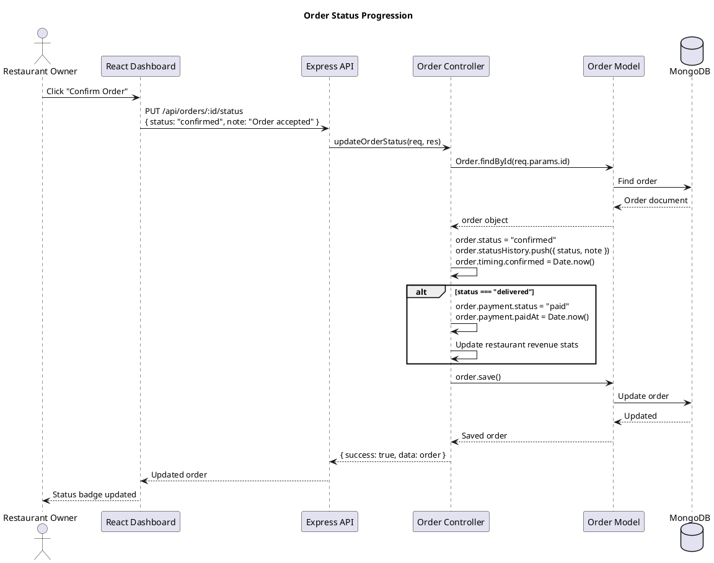

# Sequence Diagrams (PlantUML Format)

---

## 1. User Registration Sequence

---

## 2. Order Placement Sequence

---

## 3. Restaurant Owner: Update Menu Sequence

---

## 4. Order Status Update Sequence

---
*Render at: https://www.plantuml.com/plantuml/uml/*
