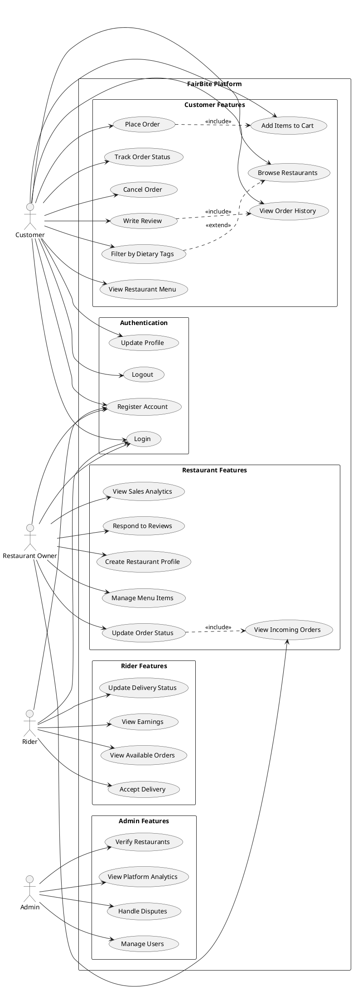
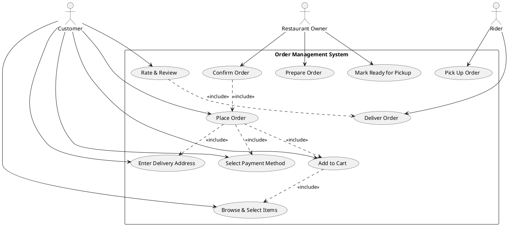
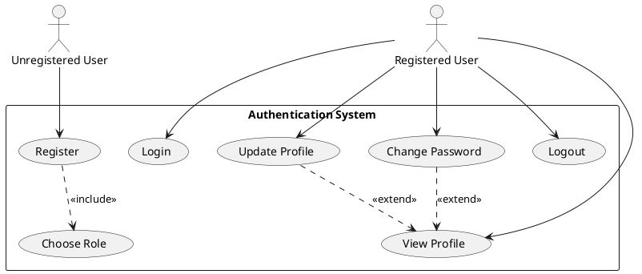

# Use Case Diagrams (Text/PlantUML Format)

> These can be rendered using PlantUML (plantuml.com) or any UML tool.

---

## Main System Use Case Diagram

---

## Order Flow Use Case (Detail)

---

## Authentication Use Case (Detail)

---
*Render these diagrams at: https://www.plantuml.com/plantuml/uml/*
*Or use draw.io / Lucidchart to recreate visually.*
