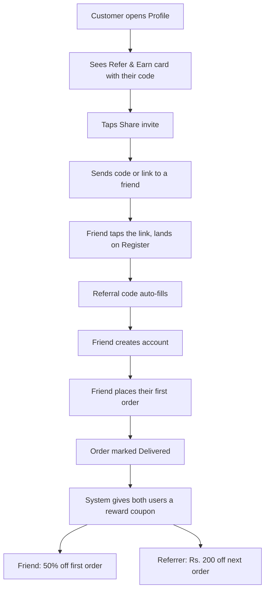
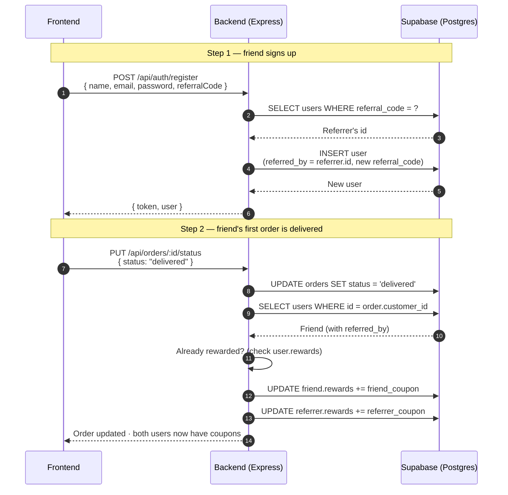

# Refer & Earn — Feature Documentation

> **Owner:** Shehroz · **Phase 2 / M7 — Advanced Features**

## What it does, in one line
A user invites a friend with their unique code; when the friend places their first order, **both** get a reward coupon.

## User flow



## Backend data flow



## What's in the database

We did **not** add new tables — we added three columns to the existing `users` table:

| Column | Type | Why |
|---|---|---|
| `referral_code` | `TEXT UNIQUE` | Each user's shareable code (e.g. `A3F8KP21`) |
| `referred_by` | `UUID` | Points to whoever's code they used at signup |
| `rewards` | `JSONB` (array) | The user's coupons — each item is `{code, type, value, source, redeemed}` |

## API endpoints we added

| Method | Path | What it returns |
|---|---|---|
| `GET` | `/api/referrals/me` | Your code, share URL, who joined with your code, reward summary |

The existing `POST /api/auth/register` now also accepts an optional `referralCode` field.

## Files touched

```
backend/
├── src/sql/migration_referral_rewards.sql     ← run once on Supabase
├── src/sql/schema.sql                         ← updated (for fresh installs)
├── src/models/User.js                         ← code generation, addReward, findReferees
├── src/controllers/authController.js          ← accepts referralCode on register + google
├── src/controllers/referralController.js      ← new — info endpoint + credit hook
├── src/controllers/orderController.js         ← calls credit hook on delivered
├── src/routes/referralRoutes.js               ← new
└── src/app.js                                 ← mounts /api/referrals

frontend/
├── src/pages/auth/LandingPage.jsx             ← referral input on Register tab
└── src/pages/customer/ProfilePage.jsx         ← Refer & Earn card
```

## Migration step (run once)

```bash
# In Supabase SQL Editor, paste the contents of:
backend/src/sql/migration_referral_rewards.sql
```

The migration is **safe to re-run** (`IF NOT EXISTS` guards on every change) and backfills referral codes for users that already exist.
