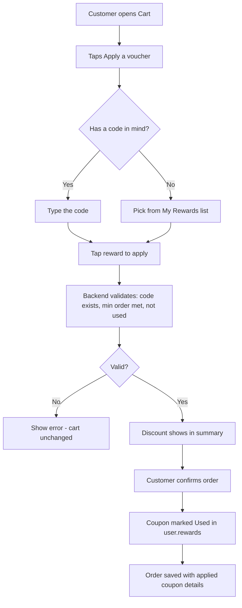
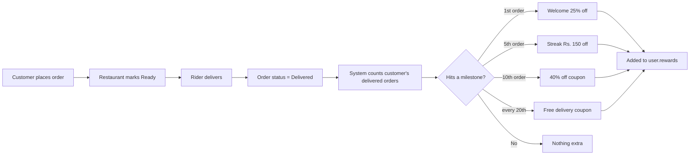
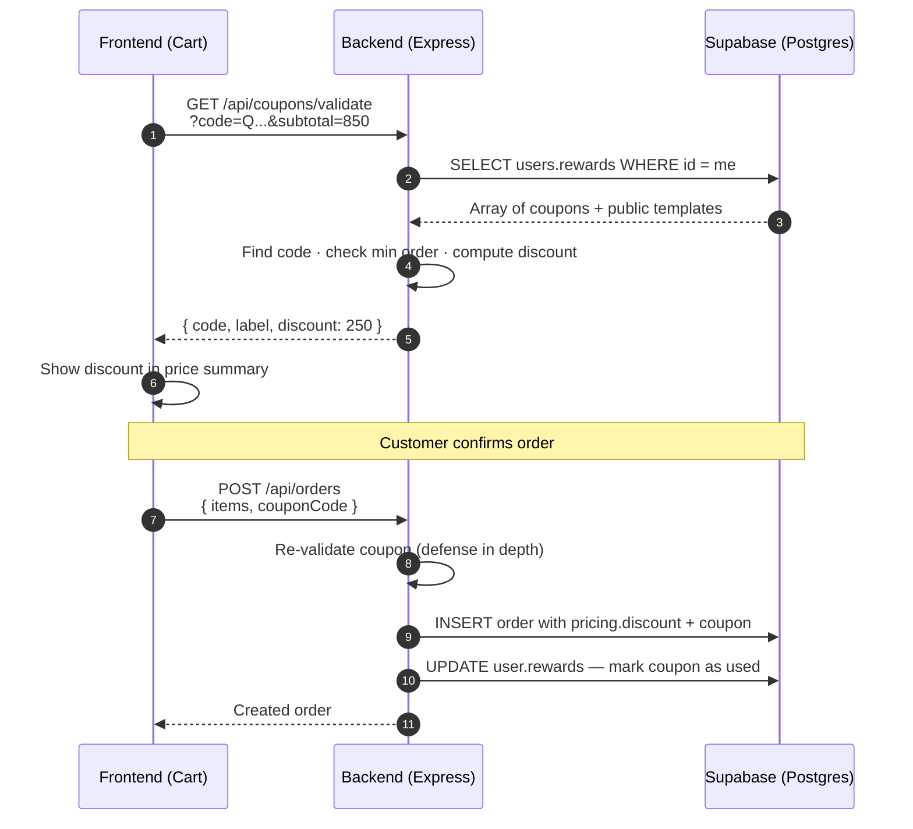
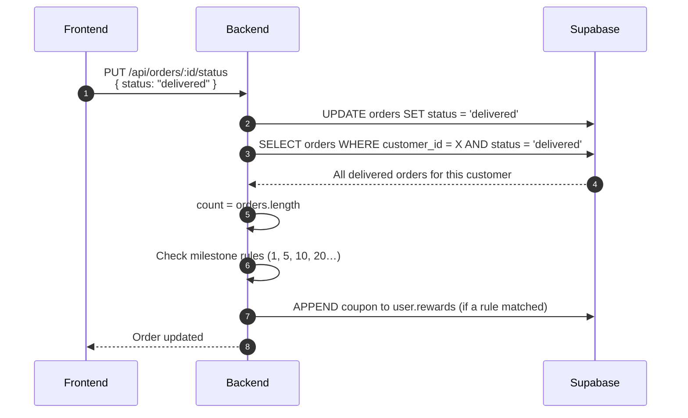

# Rewards & Coupons — Feature Documentation

> **Owner:** Shehroz · **Phase 2 / M7 — Advanced Features**

## What it does, in one line
Customers earn coupons as they use the app, can claim public promo codes, and apply any coupon at checkout to lower the bill.

## Three ways a user gets a coupon

| Source | Trigger | Example |
|---|---|---|
| Auto-grant | Order delivered | 1st order → 25% off next · 5th order → Rs. 150 off · 10th → 40% off · every 20th → free delivery |
| Public promo | Claim a published code | `QUICKBITE50`, `WEEKEND30`, `SAVE100`, `FREEBITE` |
| Referral | Friend joined + ordered (see referral feature) | Rs. 200 / 50% off |

## User flow — applying a coupon at checkout



## User flow — earning a coupon



## Backend data flow — applying a coupon



## Backend data flow — auto-grant on delivery



## What's in the database
Reuses the `users.rewards` JSONB column added by the referral feature. **No new tables.**

Each coupon row looks like:
```json
{
  "id": "c_1715800123_a8f3qr",
  "code": "MILESTONEK4F2X",
  "type": "percent",
  "value": 25,
  "minOrder": 300,
  "maxDiscount": 150,
  "label": "25% off your next order",
  "source": "welcome",
  "redeemed": false,
  "redeemed_at": null,
  "created_at": "2026-05-13T08:00:00Z"
}
```

## API endpoints we added

| Method | Path | What it does |
|---|---|---|
| `GET` | `/api/coupons/me` | Returns the user's active + used rewards + the public-promo catalog |
| `GET` | `/api/coupons/validate?code=X&subtotal=N` | Validates a code and returns the discount it would give |

`POST /api/orders` now also accepts `couponCode` and stores `pricing.discount` + `pricing.coupon` on the order row.

## Files touched

```
backend/
├── src/controllers/couponController.js     ← new — rules, validate, redeem, auto-grant
├── src/controllers/orderController.js      ← applies on create, grants on delivered
├── src/routes/couponRoutes.js              ← new
└── src/app.js                              ← mounts /api/coupons

frontend/
├── src/App.js                              ← /rewards route
├── src/pages/customer/RewardsPage.jsx      ← new — My Rewards screen
├── src/pages/customer/CartPage.jsx         ← real coupon picker + discount line
└── src/pages/customer/ProfilePage.jsx      ← My Rewards menu link
```

## How to test
1. Login as a customer. Profile → **My Rewards** shows your active coupons + public promo codes.
2. Add items totalling ≥ Rs. 500 to your cart. Tap **Apply a voucher** → enter `QUICKBITE50` → see 50% off applied (capped at Rs. 300).
3. Confirm the order. Open My Rewards → the same coupon is now under **Used**.
4. Mark the order **Delivered** as a rider. If it was your 1st delivered order, a new 25% off coupon appears in **Active**.
5. Try an expired/min-order-not-met code → backend rejects with a friendly toast.

## Notes
- Public promo codes (`QUICKBITE50` etc.) are kept in `couponController.js` for easy editing — no DB write needed to add or rename a public promo.
- Milestone rules are in the same file (`MILESTONE_RULES`); change a number to tune the schedule.
- The validation is double-checked on order creation, so a tampered frontend can't claim a fake discount.
